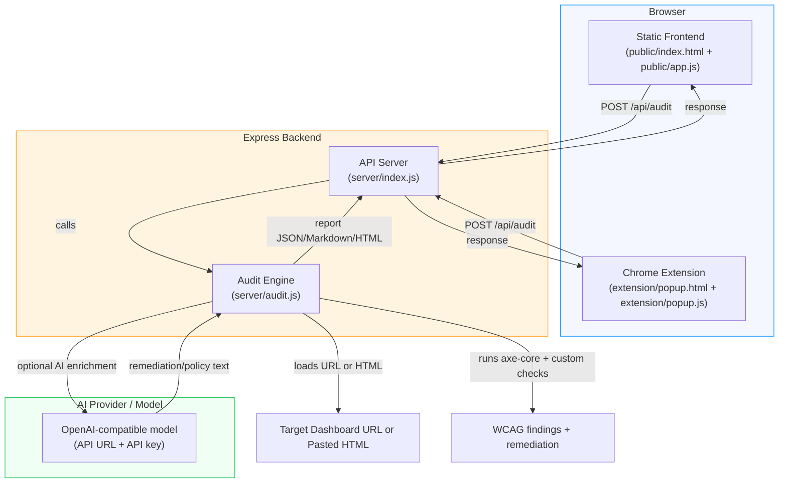

# Repository Architecture

## Key Components

- `public/`
  - `index.html`: main static interface for entering a dashboard URL or raw HTML.
  - `app.js`: client-side logic for calling `POST /api/audit`, rendering results, and exporting reports.
  - `styles.css`: app styling.

- `server/`
  - `index.js`: Express server exposing `/api/audit` and static hosting of `public/`.
  - `audit.js`: accessibility scanning engine using `jsdom`, `axe-core`, custom WCAG checks, AI enrichment, and report generation.

- `extension/`
  - `popup.html`, `popup.js`, `popup.css`: Chrome extension MVP that captures the active tab DOM and sends it to the same audit API.

- AI integration
  - Uses environment variables (`AI_API_KEY`, `AI_API_URL`, `AI_MODEL`, `AI_ENABLED`) to decide whether to enrich findings with model-generated remediation.

## Data Flow

1. User enters a dashboard URL or pasted HTML in the static web UI.
2. Browser sends the payload to `POST /api/audit`.
3. Express server forwards the request to the audit engine.
4. Audit engine fetches HTML or uses provided HTML, then performs:
   - `axe-core` accessibility scanning
   - custom checks for labels, icon buttons, keyboard access, contrast, and other HR/payroll dashboard risks
5. If AI is configured, the engine calls the model for tailored remediation guidance and legal-facing summary.
6. The server returns the merged audit report.
7. The UI displays findings and allows export to JSON, Markdown, or HTML.

## Extension Flow

- The Chrome extension collects the active tab's HTML snapshot.
- It sends the page payload to the same local audit API.
- Results display in the extension popup and can also be exported.
